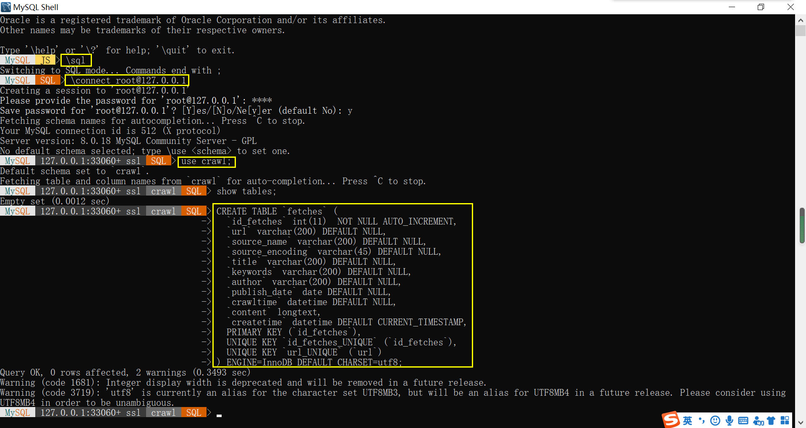
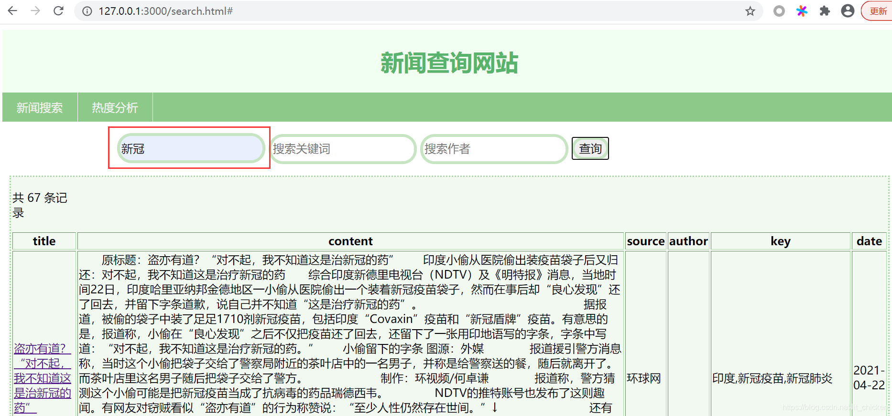
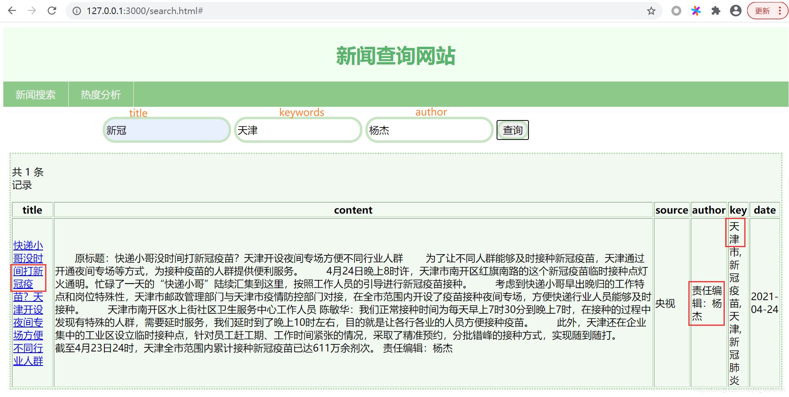
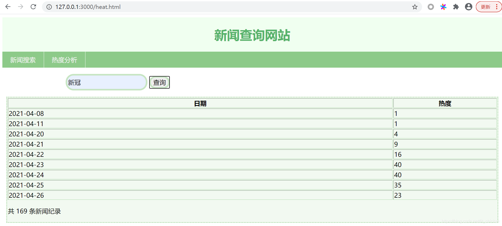
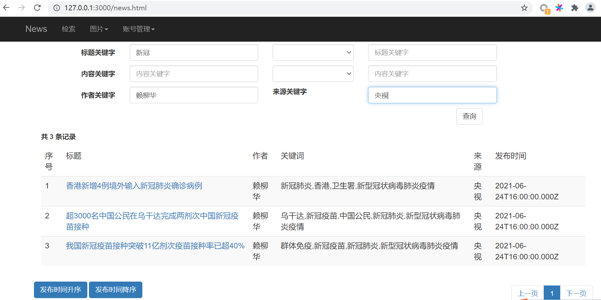
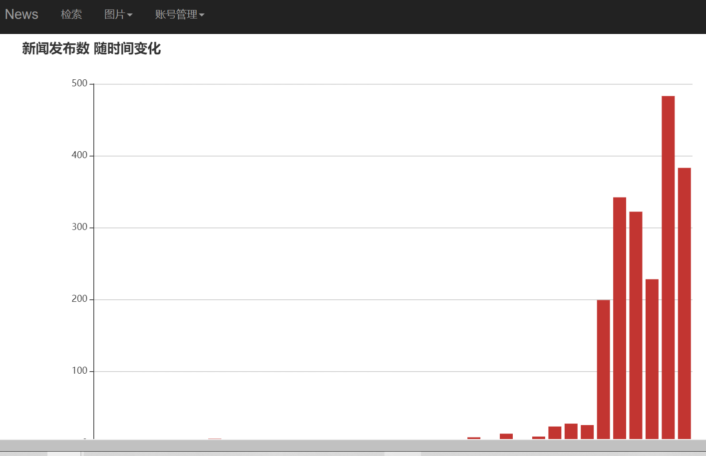
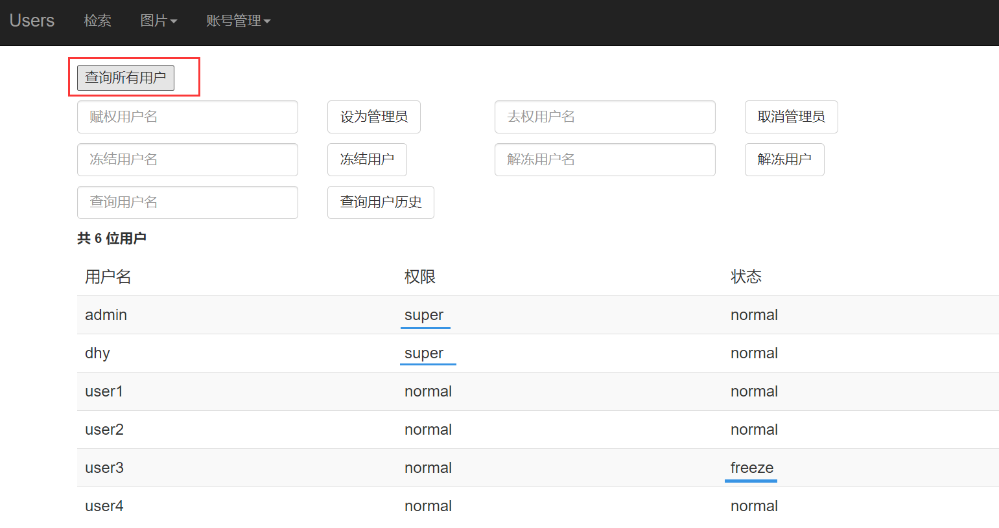
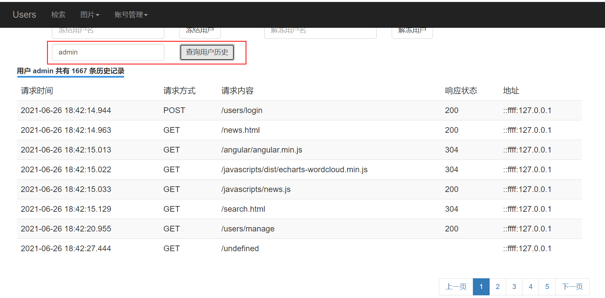

# Project1——Nodejs新闻爬虫及查询网站


## 数据库配置

```mysql
create database crawl;
use crawl;
create table 'fetches'......(相关命令见fetches.sql)
```




## 前端搭建及运行

cmd中，在Project1目录下输入命令，创建网站框架

```shell
express -e search_site
```


将mysql.js文件拷贝至search_site文件夹，并切换至该目录，

```shell
npm install mysql -save 
npm install
```


运行项目，进入search_site，cmd运行：

```shell
node bin/www
```

浏览器中打开：http://127.0.0.1:3000/search.html









具体项目构建过程详见：[Web编程实践作业——Nodejs新闻爬虫及查询网站](https://blog.csdn.net/lit_chicken/article/details/116073834)


# Project2——Angular+nodejs-express搭建简易新闻查询网站

该项目基于上一个项目修改完成，具体构建过程见：[Web编程期末实践——Angular+nodejs-express搭建简易新闻查询网站](https://blog.csdn.net/lit_chicken/article/details/118339307)


结果展示：











